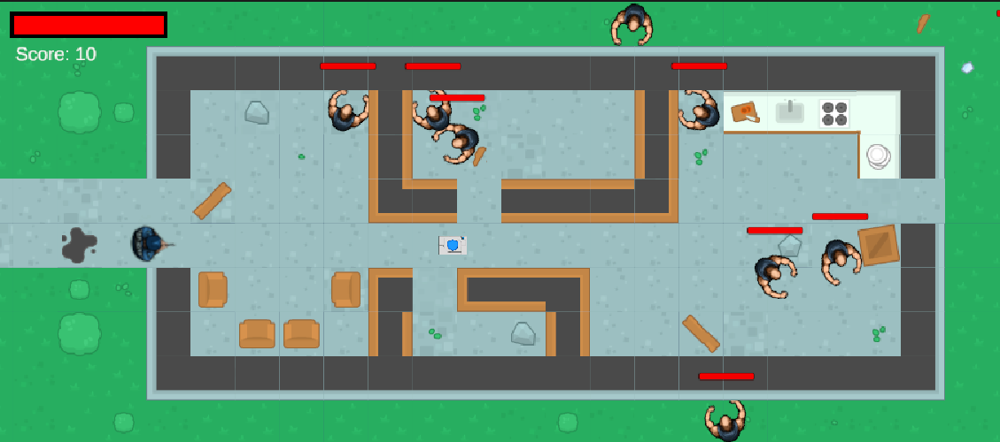
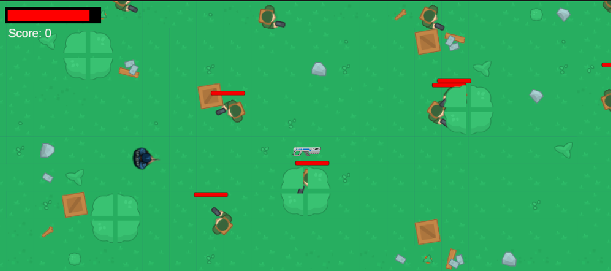
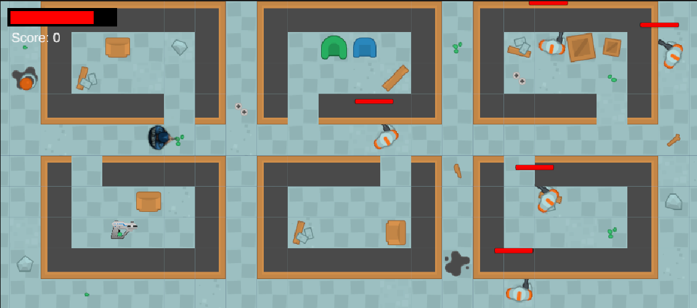
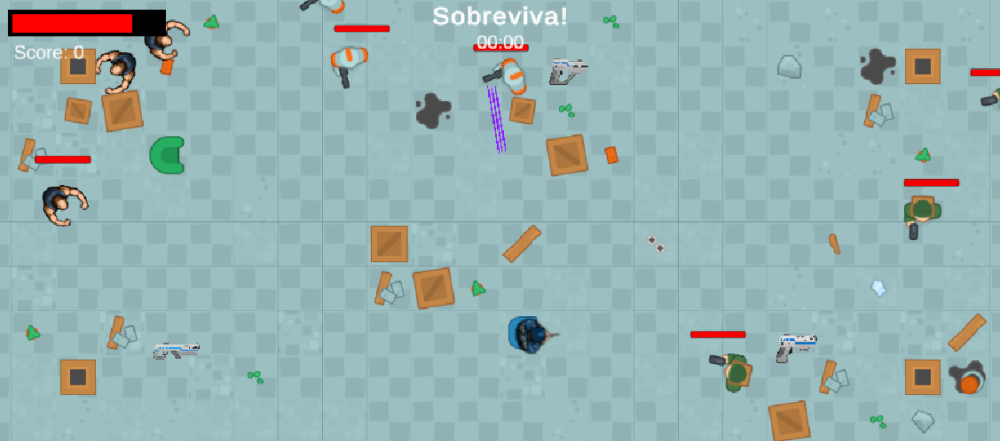

# Dysto-Exodus: Dimensional Havoc / Dysto-Exodus: Destruição Dimensional

## Game Overview
**Engine:** Unity (v.2022.3.8f1)
**Genre:** Top-down action with shooting and melee combat elements  
**Target Audience:** Teenagers and Adults (16+)

---

## Storyline
In a dystopian future following a multidimensional calamity, the player awakens as the last survivor of a vigilante fleet. Surrounded by a post-apocalyptic world filled with zombies, hostile robots, and ruthless raiders, the player’s hope lies in finding a legendary survivor camp with the technology to restore dimensional order.

Guided by "The Traveler," a mysterious NPC, the player embarks on a journey through unique dimensions, facing varied enemies and uncovering the secrets behind the calamity. The story unfolds through progressive revelations, leading to an epic climax where the player fights to restore order across dimensions.

---

## Gameplay
- **Objectives:**
  - Collect items and weapons to defeat enemies.
  - Locate the legendary survivor camp.
  - Uncover the truth behind the calamity and find a way to reverse it.
  - Restore dimensional order.

- **Key Features:**
  - Dynamic levels with environmental puzzles and challenges.
  - Adaptive combat against zombies, raiders, and robots.
  - NPC guidance and story progression through interactions.

---

## Characters
- **The Survivor:** The player character, skilled in melee and ranged combat.
- **Enemies:**
  - Zombies
  - Raiders
  - Advanced robots

---

## Environments
1. **Ruined City:** Zombie-infested streets and collapsed skyscrapers.
2. **Foggy Forest:** Raider-controlled areas with hidden secrets.
3. **Futuristic City:** Robot-guarded zones with advanced technology.

Each dimension presents unique challenges, enemies, and atmospheric design.

---

## Key Mechanics
- **Combat:**
  - Melee weapons, mid-range firearms, and a flamethrower for hordes.
  - Quick weapon/item switching and dodging mechanics.
- **Puzzle Solving:** Environmental puzzles to unlock paths and rewards.
- **Dynamic Events:** Multidimensional shifts alter enemies and scenery.
- **Progression:**
  - Unlockable weapons and collectible items to enhance gameplay.

---

## Controls
- **Movement:** WASD or arrow keys  
- **Combat:**
  - Left-click: Attack/shoot
  - Right-click: Melee  
- **Interaction:** Dedicated key for engaging with objects and NPCs  
- **Weapon Swap:** Quick switch between weapons  
- **Dodging:** Agile roll to avoid enemy attacks  

---

## Additional Features
- **Mini-Games:** Puzzles offering additional rewards and story insights.  
- **Bonus Levels:** Unlockable stages with extra challenges and special rewards.  
- **Camera Movements:** Dynamic zoom and transitions for immersive gameplay.  

---

## Development
The game is being developed in **Unity**, with accessible hardware requirements (Windows PC with HDD or SSD). The release aims to provide a smooth experience for a wide audience of PC players.

---

## Dimensional Map and Progression
The dimensional calamity has fragmented reality into three main areas:  
- **Ruined City:** Desperation and survival.  
    - 
- **Foggy Forest:** Mystery and tension.
    - 
- **Futuristic City:** Danger and advanced technology.
    - 
- **Final Level:** Timed Final Level.
    -   

Players will navigate these areas while unraveling the story, guided by in-game maps and hints.

---

## Contact and Updates
Stay tuned for updates and progress logs! Follow the repository for the latest developments and sneak peeks at what’s coming.